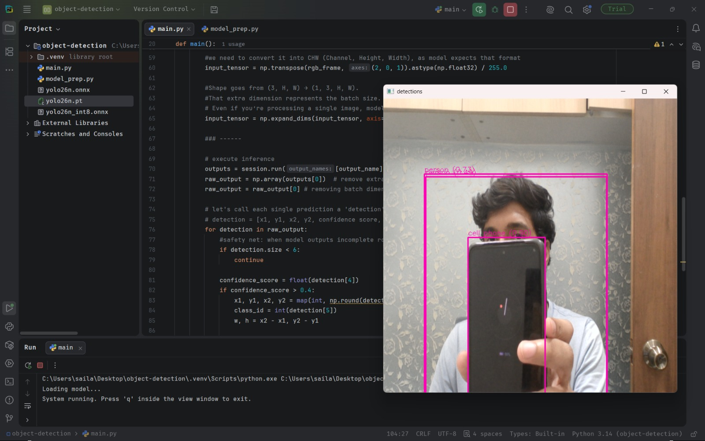
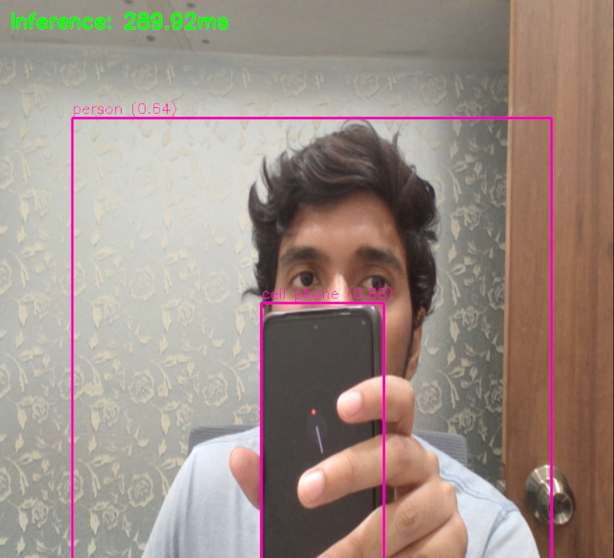
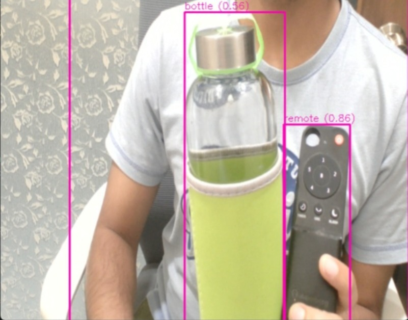
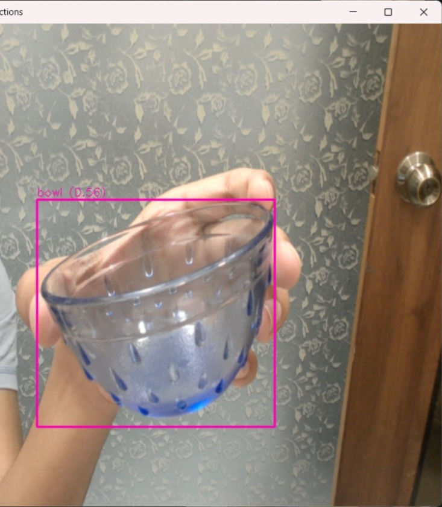

# Real-Time Object Detection

### The Deep Learning Engine: YOLO (You Only Look Once)
At the core of this project is a quantized **YOLO** (You Only Look Once) neural network. Unlike traditional object detection models that apply classifiers to multiple different regions of an image one by one, YOLO treats object detection as a single regression problem. It looks at the entire image exactly once, passing it through a single convolutional network to simultaneously predict multiple bounding boxes and class probabilities. 

By utilizing an **INT8 Quantized** version of YOLO, the model's 32-bit floating-point weights have been mathematically compressed into 8-bit integers. This drastically reduces the memory footprint and computational bandwidth required, allowing this advanced architecture to run entirely on localized edge hardware.

---

## 🚀 Project Overview

This project is a high-performance, real-time object detection dashboard written entirely in Python. It is designed to run localized computer vision models at edge-level latencies without relying on heavy cloud infrastructure. 

By leveraging **ONNX Runtime** for hardware-accelerated matrix multiplication and **OpenCV** for direct matrix manipulation, this engine bypasses the typical bloat of standard deep learning pipelines. It intakes a raw webcam feed, pre-processes the multidimensional tensors using NumPy, and renders a quantized YOLO tracking model in real-time.

### Key Features
* **Bare-Metal Efficiency:** Utilizes ONNX Runtime for optimized, local CPU inference, avoiding the overhead of heavy frameworks like PyTorch during deployment.
* **Zero-Dependency NMS:** Parses pre-filtered 3D bounding box tensors `` directly from the quantized model graph, eliminating the need for expensive manual Non-Maximum Suppression (NMS) calculations.
* **Real-Time Telemetry:** Features a custom OpenCV Heads-Up Display (HUD) that renders dynamic bounding boxes, COCO dataset class labels, confidence scores, and live millisecond latency metrics.
* **Lightweight Architecture:** Written purely in Python, utilizing NumPy's vectorized operations for hyper-fast frame preprocessing (BGR to RGB conversion, scaling, and batch-dimension expansion).

### Tech Stack
* **Language:** Python 3.x
* **Computer Vision:** OpenCV (`cv2`)
* **Matrix Operations:** NumPy
* **Deep Learning Engine:** ONNX Runtime

---

## 📊 Hardware & Performance Benchmarks

This engine is specifically engineered to be highly portable, testing the limits of what is possible on standard, low-power edge hardware without requiring dedicated cloud GPU clusters.

**Current CPU-Only Benchmarks:**
* **Hardware:** Standard Laptop CPU (Power-saving microarchitecture, no dedicated GPU utilization).
* **Model Pipeline:** YOLO INT8 Quantized.
* **Average Latency:** ~190ms – ~300ms (~3.33 to ~5.5 FPS).

**Architecture Notes:**
The current latency is a direct reflection of physical hardware constraints, not software bloat. The surrounding Python/NumPy pipeline (BGR to RGB conversion, array scaling, matrix formatting, and OpenCV HUD rendering) executes in under **5 milliseconds**. 

The remaining latency is entirely bottlenecked by the physical CPU vectorization limits during the `Session.Run()` matrix multiplication phase. Power-saving CPUs lack the advanced hardware vectorization cores (like AVX-512 VNNI) required for high-speed integer math. 

**Scaling to Real-Time (30+ FPS):**
Because the pipeline is fully optimized, the architecture is built to scale instantly. To achieve sub-30ms latency on capable hardware, the ONNX Runtime execution provider simply needs to be shifted from `CPUExecutionProvider` to a hardware-accelerated pipeline like `DmlExecutionProvider` (DirectML) or `CUDAExecutionProvider`, seamlessly offloading the tensor math to dedicated graphics cores.

---

## 📸 Detection Gallery

Here are additional examples of the engine successfully classifying and tracking multiple objects in varying environments:

